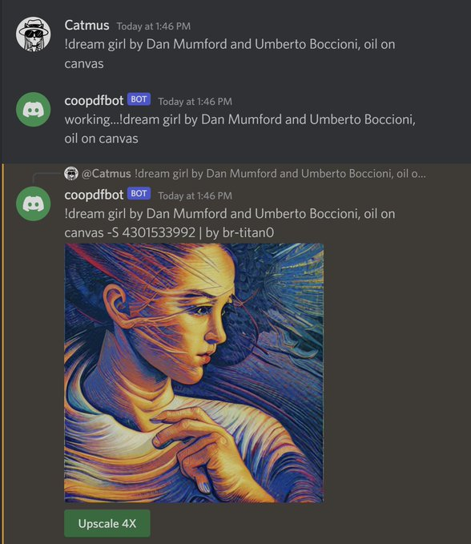
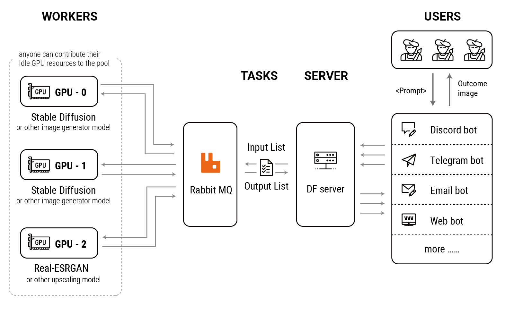

# dfserver

DFserver is an open-sourced distributed backend AI pipeline server for building self-hosted distributed GPU cluster to run the [Stable Diffusion](https://stability.ai/blog/stable-diffusion-public-release) model, but also has a potential to expend to general AI image or prompt generative models, large-scale production service, and etc.

Give us a star and your valuable feedback :)

The service can uses idle fancy GPUs shared by your friends to build a GPU cluster for running various AI models or just be deployed on your own computer. In the future we will support counting and distributing possible revenue based on the workload of each GPU (Worker).

I have a beautiful vision for DFserver, which can be an enterprise-level service application that can flexibly extend the pipeline to connect models for different tasks in the AI image generation workflow, such as DeepL for supporting multi language prompt input, or Gobig by DD for filling more rendering details while upscale, or even prompt building targeted fine-tune GPT model.

Will soon support the generation of multiple images with a single command, and functions related to init-image.




# System Topology



# Task Sequence Diagram


# Getting Start

### Server Prerequisites

- [RabbitMQ](https://www.rabbitmq.com/)
- [discord developer](https://discord.com/developers/docs/intro#bots-and-apps) account and a discord bot token

### Worker Prerequisites

- A group of friends who have fancy GPUs 🤪
- [pytorch](https://github.com/pytorch/pytorch)
- [diffusers](https://github.com/huggingface/diffusers) and [models](https://huggingface.co/CompVis/stable-diffusion-v1-4)

### Build the dfserver

Requirements:

- [Go 1.18 or newer](https://golang.org/dl/)

```bash
$ git clone "https://github.com/huo-ju/dfserver.git"
$ cd dfserver
$ make linux-amd64 #or make linux-arm64
```

### dfserver Configuration

```bash
cp configs/config.toml.sample configs/config.toml
```

Edit the config.toml, setup the username/password/host address/port of the rabbitmq.

The default configuration was defined ONE task queue for stable diffusion ai worker (name is ai.sd14), ONE discord bot service, ONE process worker for discord(name is discord.server1)

### Run dfserver

```bash
./dist/linux_amd64/dfserver --confpath=./configs
```

### AI Worker Install 

Copy the `pyworker` dir to the GPU server, and install all diffusers dependencies(nvidia drivers, CUDA, pytorch, models etc...).

```bash
cd pyworker
pip install -r requirements.txt
git clone https://github.com/huggingface/diffusers.git
```

### AI Worker Configuration

```bash
cp configs/sd14_config.ini.sample configs/sd14_config.ini 
#or
cp configs/realesrgan_config.ini.sample configs/realesrgan_config.ini
#or
cp configs/clipinterrogator_config.ini.sample configs/clipinterrogator_config.ini
```

Edit the config.ini, setup the username/password/host address/port of the rabbitmq.

### Run the ai worker
```bash
python worker.py sd14 #stable-diffusion worker
#or
python worker.py realesrgan #realesrgan upscaling worker
#or
python worker.py clipinterrogator # clip-interrogator worker
```

### Useage

Add the discord bot to your disord server, and input your prompt.

For example:

`!dream Cute sticker design of a AI image generator robotic pipeline service, app icon, trending on appstore, trending on pixiv, hyper-detailed, sharp`


The ai task will be collected from user input by discord bot, and published to the rabbitmq, then the task will be fetched by ai worker (running on GPU servers). 

The result (generated images) will be published back to the rabbitmq, fetched by process worker (discord.server1), and sent back to the user.

Run the dfserver and aiworker on boot, please see the systemd scripts in `deployments`

# TODO

* ✔️  Response error messages to users
* ✔️  More AI workers, eg: upscale worker 
* [] Multi GPUs worker support
* [] Initial image
* [] Mask/Inpaint

# Credits

- [stability.ai](https://stability.ai/)
- [pharmapsychotic](https://github.com/pharmapsychotic/clip-interrogator) for clip-interrogator
- @[catmus](https://twitter.com/recatm)
